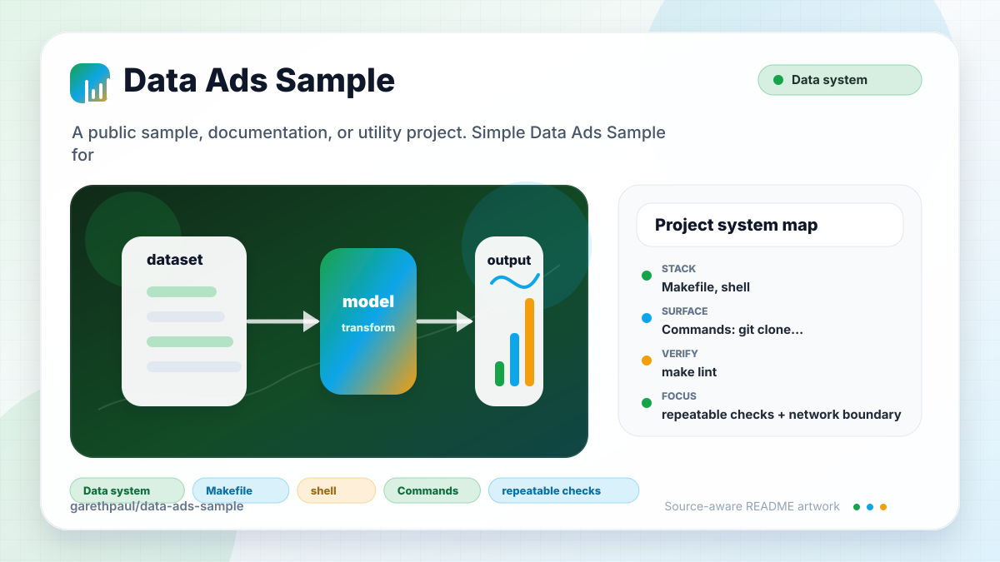

# data-ads-sample

<!-- README-OVERVIEW-IMAGE -->


## Overview

`garethpaul/data-ads-sample` is a public sample, documentation, or utility project. Simple Data Ads Sample for Ads API + GNIP.

No runnable Ads API or GNIP implementation is currently checked in. The
repository is prepared for a future credential-safe sample with explicit setup,
safe fixture data, and a local verification command added alongside the first
implementation.

The readiness guard rejects orphan runtime source files until a complete
implementation transition adds the chosen runtime manifest, setup, tests,
credential handling, fixture provenance, and updated repository contracts.
It also rejects unapproved tracked executable files; only the two readiness
scanner scripts retain executable mode while the repository is documentation-only.

This README is based on the checked-in source, manifests, scripts, and repository metadata on the `master` branch. The project language mix found during review was: no dominant source language detected.

## Repository Contents

- `.github/workflows/check.yml` - hosted readiness and data-safety baseline
- `SECURITY.md` - security reporting and disclosure guidance
- `VISION.md` - project direction and maintenance guardrails
- `CHANGES.md` - maintenance history
- `docs/data-fixture-policy.md` - safe fixture criteria for future sample data
- `docs/fixture-provenance-template.md` - review template for future fixture data
- `scripts/check-baseline.sh` - source-level repository baseline guard
- `tests/check-baseline.sh` - isolated scanner behavior and redaction tests
- `docs/plans` - dated implementation and maintenance plans

Additional scan context:

- Source directories: no top-level source directories detected
- Dependency and build manifests: none detected
- Entry points or build surfaces: `scripts/check-baseline.sh`
- Test entry point: `tests/check-baseline.sh`

## Getting Started

### Prerequisites

- Git

### Setup

```bash
git clone https://github.com/garethpaul/data-ads-sample.git
cd data-ads-sample
```

The setup commands above are derived from repository files. Legacy mobile, Python, or JavaScript samples may require older SDKs or package versions than a modern workstation uses by default.

## Running or Using the Project

No single runtime entry point exists yet. Start by reading the source files and
manifests listed above, then add the smallest runnable Ads API/GNIP flow with
safe sample data when implementation begins.

## Testing and Verification

Run the repository readiness guard before committing changes:

```bash
make lint
make test
make build
make check
scripts/check-baseline.sh
```

The current guard verifies that this documentation-only sample has no runtime
manifest yet, ignores likely local credential and private-export paths, scans
for obvious token material, rejects tracked symlinks and Git submodules that
could escape the repository scan boundary, and documents the required follow-up when the first
real implementation is added. `make test` runs isolated mutation tests for the
scanner's secret, bearer-token, account-context, tracked-symlink, gitlink, and
filename-only redaction behavior. No application runtime tests exist until
runnable Ads API/GNIP code is added; `make build` continues to run the readiness
guard.
The readiness guard requires ripgrep (`rg`) for secret and manifest scans; the
script exits with an explicit prerequisite message when it is missing.
Credential and account-context findings report filenames without echoing
matched values, so a failed local or hosted check does not copy secrets into
terminal or CI logs.
Tracked engineering plans are scanned for credential and account values under
the same filename-only redaction boundary as other repository content.
Generic secret scans include modern fine-grained GitHub token values while
keeping diagnostics limited to affected filenames.

GitHub Actions runs `make check` for pushes, pull requests, and manual
dispatches. The workflow uses a commit-pinned checkout action, read-only
repository access, a credential-free checkout, and a bounded Ubuntu 24.04
runtime. CI installs ripgrep as the sole readiness tool without adding a
project package manager or runtime dependency.

When the required SDK or runtime is unavailable, use static checks and source review first, then verify on a machine that has the matching platform toolchain.

## Configuration and Secrets

- No required secret or credential file was identified in the repository scan.
- Future Ads API or GNIP credentials must stay in environment variables or local
  untracked configuration such as `.env`, which is ignored by this repository.
- Use `.env.example` only for empty placeholder names, and keep real values in
  ignored local files or external secret stores. See
  `docs/credential-handling-policy.md` before adding code that reads
  credentials.
- Keep Ads account context placeholders such as account and customer IDs empty
  in tracked files; real account context belongs in ignored local config.
- The readiness scanner rejects populated account or customer ID assignments in
  tracked content and reports filenames without echoing matched values.
- Keep private, raw, cached, and exported Ads/GNIP data under ignored local
  directories until the project defines safe publishable fixtures.
- Future fixture data must follow `docs/data-fixture-policy.md` before it is
  committed.
- Future fixture pull requests must complete the fixture provenance checklist
  with source, license, PII review, and size rationale details. Use
  `docs/fixture-provenance-template.md` for that record.

## Security and Privacy Notes

- The scan did not identify production authentication, payment, or secret-management code. Treat future additions in those areas as security-sensitive.

## Maintenance Notes

- See `SECURITY.md` for vulnerability reporting and safe research guidance.
- See `VISION.md` for project direction and contribution guardrails.
- See `CHANGES.md` for maintenance history.
- Root `make lint`, `make test`, `make build`, and `make check` all preserve
  the documentation-only readiness baseline until implementation begins.
- See `docs/plans/2026-06-09-readiness-make-gates.md` for the root gate
  baseline.
- See `docs/plans/2026-06-09-readiness-ripgrep-prerequisite.md` for the
  readiness tool prerequisite guard.
- See `docs/plans/2026-06-10-ci-baseline.md` for the hosted readiness and
  data-safety baseline.
- See `docs/plans/2026-06-10-readiness-scan-redaction.md` for filename-only
  credential findings and populated account-context detection.
- See
  `docs/plans/2026-06-12-001-test-readiness-scanner-regressions-plan.md` for
  the isolated scanner behavior and redaction test contract.
- See `docs/plans/2026-06-12-tracked-symlink-guard.md` for the rule that keeps
  readiness scans inside the tracked repository tree.
- See `docs/plans/2026-06-13-tracked-gitlink-guard.md` for the rule that keeps
  external submodule content outside this documentation-only repository.
- If a runtime manifest such as `package.json`, `requirements.txt`, or
  `pyproject.toml` is added, update `scripts/check-baseline.sh` with the real
  install and verification commands in the same change.
- If fixture data is added, keep it small, synthetic or publishable, and update
  the guard to distinguish safe fixtures from private exports.
- Use `docs/data-fixture-policy.md` to decide whether a future Ads/GNIP sample
  fixture is safe to publish.
- Use `docs/credential-handling-policy.md` to keep Ads API and GNIP credential
  names, placeholder files, and redacted logging expectations aligned.
- Keep account context placeholders empty until runnable sample code defines
  how account and customer IDs are supplied locally.
- Use the fixture provenance checklist before committing any future sample
  fixture, and keep a completed `docs/fixture-provenance-template.md` record or
  equivalent plan fields with the fixture change.

## Contributing

Keep changes small and tied to the project that is already present in this repository. For code changes, document the toolchain used, avoid committing generated dependency directories or local configuration, and update this README when setup or verification steps change.
